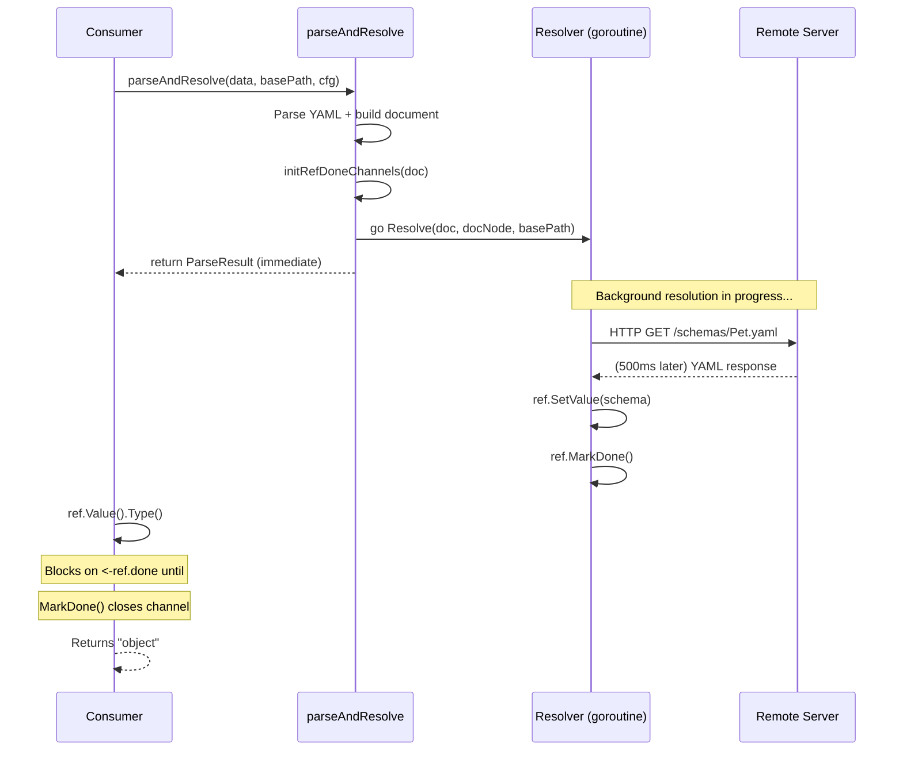

# Background Reference Resolution

## Overview

The OpenAPI 3.0 parser supports **background reference resolution** — `ParseFile()` returns immediately while `$ref` references resolve concurrently in a background goroutine. Consumers only block when they access a specific ref's value.

## How It Works



## Key Components

### Ref Model Structs (`models/openapi30/ref_*.go`)

Each ref type (e.g. `SchemaRef`, `ResponseRef`) has:

| Field | Type | Purpose |
|---|---|---|
| `value` | `*T` (private) | The resolved model (e.g. `*Schema`) |
| `circular` | `bool` (private) | Whether a circular reference was detected |
| `done` | `chan struct{}` | Closed when resolution completes; `nil` for inline values |
| `err` | `error` | Resolution error, if any |

#### Methods

| Method | Blocking? | Purpose |
|---|---|---|
| `Value()` | ✅ Yes | Returns resolved value; blocks on `done` channel |
| `Circular()` | ✅ Yes | Returns circular flag; blocks on `done` channel |
| `ResolveErr()` | ✅ Yes | Returns resolution error; blocks on `done` channel |
| `RawValue()` | ❌ No | Returns value without blocking (resolver use only) |
| `RawCircular()` | ❌ No | Returns circular flag without blocking (resolver use only) |
| `SetValue(v)` | ❌ No | Sets the resolved value (resolver use only) |
| `SetCircular(c)` | ❌ No | Sets the circular flag (resolver use only) |
| `SetResolveErr(e)` | ❌ No | Sets the resolution error (resolver use only) |
| `InitDone()` | ❌ No | Creates the done channel |
| `MarkDone()` | ❌ No | Closes the done channel, unblocking waiters |

### Parser (`parsers/openapi30x/parse.go`)

`parseAndResolve()` orchestrates the flow:

```go
func parseAndResolve(data []byte, basePath string, cfg *shared.ParseConfig) (*ParseResult, error) {
    // 1. Parse YAML into document model
    doc, err := parseOpenAPI(docNode, ctx)

    // 2. If resolution is enabled:
    initRefDoneChannels(doc)  // Init done channels BEFORE goroutine
    result.done = make(chan struct{})
    go func() {
        defer close(result.done)
        Resolve(doc, docNode, basePath)
    }()

    return result, nil  // Returns immediately
}
```

`ParseResult` provides `Wait()` to block until all resolution completes:

```go
func (r *ParseResult) Wait() error {
    if r.done != nil {
        <-r.done
    }
    return r.resolveErr
}
```

### Resolver (`parsers/openapi30x/resolve.go`)

The resolver walks the entire document tree and resolves each `$ref`:

1. **Local refs** (`#/components/schemas/Pet`) — resolved via JSON pointer within the root document
2. **External file refs** (`./models.yaml#/Tag`) — file read from disk, then JSON pointer
3. **Remote URL refs** (`https://example.com/pet.yaml`) — HTTP fetch, then JSON pointer

For each ref, the resolver:
```
if ref.Ref != "" && ref.RawValue() == nil:
    result = r.Resolve(ref.Ref)      // fetch + parse
    ref.SetValue(parsedModel)         // set the resolved value
    ref.MarkDone()                    // close done channel → unblock waiters
```

### Done Channel Initialization (`initRefDoneChannels`)

`initRefDoneChannels()` walks the document tree **before** the goroutine starts, calling `InitDone()` on every ref with a `$ref` string. This ensures that:

- `Value()` correctly blocks even if called before the resolver reaches that ref
- No race condition between channel creation and consumption

> [!IMPORTANT]
> `InitDone()` must be called **before** the background goroutine starts. If the `done` channel is `nil` when `Value()` is called, it returns immediately without blocking — returning `nil` for unresolved refs.

## Usage Patterns

### Pattern 1: Access properties immediately (auto-blocking)

```go
result, _ := openapi30x.ParseFile("api.yaml")

// This blocks until the Pet schema ref is resolved:
petType := result.Document.Components().Schemas()["Pet"].Value().Type()
```

### Pattern 2: Wait for all resolution, then access freely

```go
result, _ := openapi30x.ParseFile("api.yaml")
result.Wait()  // block until everything is resolved

// All access is instant after Wait():
pet := result.Document.Components().Schemas()["Pet"].Value()
fmt.Println(pet.Type())
fmt.Println(pet.Properties()["name"].Value().Type())
```

### Pattern 3: Parse without resolution

```go
// Parse() does not resolve refs — no background goroutine, no blocking
result, _ := openapi30x.Parse([]byte(yamlData))

// ref.Value() returns nil immediately (no done channel, no blocking)
ref := result.Document.Components().Schemas()["Pet"]
fmt.Println(ref.Ref)     // "#/components/schemas/Pet"
fmt.Println(ref.Value()) // <nil>
```

## Error Handling

Resolution errors are stored **per-ref**, not globally:

```go
result, _ := openapi30x.ParseFile("api.yaml")
result.Wait()

ref := result.Document.Components().Schemas()["MissingSchema"]
if err := ref.ResolveErr(); err != nil {
    // e.g. "resolving schema ref "missing.yaml#/Foo": file not found"
    log.Printf("resolution failed: %v", err)
}
```

## Circular References

When the resolver detects a circular reference, it marks the ref as circular and does not populate the value:

```go
result, _ := openapi30x.ParseFile("api.yaml")
result.Wait()

items := treeNode.Value().Properties()["children"].Value().Items()
items.Circular() // true
items.Value()    // nil — circular refs have no value
```
