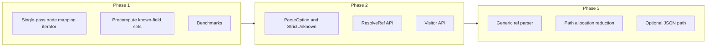

# OpenAPI 3.0 Parser Improvement Plan

## Current Implementation Summary

The parser in [parsers/openapi30](parsers/openapi30) is already strong in several areas:

- **Lossless parsing** via `yaml.Node`: line/column and `NodeSource.Raw` preserved for every node.
- **Descriptive layout**: one file per OpenAPI concept (`operation.go`, `operation_parameters.go`, `schema_allof.go`, etc.) with clear delegation from root ([openapi.go](parsers/openapi30/openapi.go)) down.
- **Unknown field detection**: [known_fields.go](parsers/openapi30/known_fields.go) + [unknown_fields.go](parsers/openapi30/unknown_fields.go) with path and position.
- **Structured errors**: [errors.go](parsers/openapi30/errors.go) `ParseError` with JSON path, line/column, and `Unwrap()`.
- **No eager $ref resolution**: refs stored as strings in `*Ref` types; resolution can be added as an optional layer.

Compared to **kin-openapi** (standard Go OpenAPI library): they use `json.Unmarshal` and custom `UnmarshalJSON`; no source positions; they do validation and ref resolution. This parser differentiates with positions, unknown-field reporting, and YAML-first lossless design.

---

## 1. Performance Improvements

### 1.1 Single-pass mapping iteration (high impact)

Today, for every mapping we do:

- `nodeKeys(node)` → one full scan of `Content`
- For each key, `nodeGetValue(node, key)` → another scan

So each mapping is **O(keys × scan)**. Example in [openapi.go](parsers/openapi30/openapi.go) (paths):

```go
for _, key := range nodeKeys(node) {
    pathItemNode := nodeGetValue(node, key)
    ...
}
```

**Change:** Add and use a single-pass iterator in [node_helpers.go](parsers/openapi30/node_helpers.go), e.g. `nodeMapPairs(node)` returning `[]struct{Key string; Value *yaml.Node}` (or a range-over-func iterator in Go 1.23+). Replace all “nodeKeys + nodeGetValue per key” loops with this single pass. This removes redundant scans and allocations for key slices.

### 1.2 Precompute known-field sets (medium impact)

[unknown_fields.go](parsers/openapi30/unknown_fields.go) builds a `map[string]bool` from the known-field slice **for every object** during `detectUnknownNodeFields`. The same slices are reused everywhere (e.g. `schemaKnownFields`).

**Change:** At init (or in a generated file), build one `map[string]struct{}` per type (e.g. `knownFieldsSetSchema`) and pass that into `detectUnknown` instead of `[]string`. Avoids repeated slice iteration and map construction per node.

### 1.3 Reduce ParseContext allocations (medium impact)

[context.go](parsers/openapi30/context.go) `Push(segment)` allocates a new slice and copies the path on every call. Deep documents (paths → operations → parameters, etc.) cause many small allocations.

**Change:** Consider a path representation that avoids copying on push (e.g. a single backing slice with a length “stack”, or a pool of path buffers). Alternatively, keep the current API but document that hot paths can use a context pool if needed. Measure with benchmarks before and after.

### 1.4 Optional JSON path (lower priority)

[parse.go](parsers/openapi30/parse.go) uses only `yaml.Unmarshal`; JSON input works because YAML is a superset, but a dedicated JSON path can be faster for large JSON-only specs.

**Change:** If the first non-whitespace byte is `{`, use `encoding/json` to decode into a generic tree, then either convert to something node-like with positions (e.g. a small “JSON node” type with offset/line) or keep a single code path and accept that JSON uses the YAML decoder. Only add a JSON branch if benchmarks show real gain; otherwise keep one code path for simplicity.

---

## 2. Go Language and Stdlib Usage

### 2.1 Bump Go version and adopt modern features

- **go.mod**: Currently [go.mod](go.mod) is `go 1.21`. Move to **1.22** or **1.23** so the project can rely on newer stdlib and language behavior.
- **Range-over-func (Go 1.23)**: Optionally expose or use iterators for “visit all path items” or “visit all operations” without building full in-memory structures, e.g. `iter.Seq2[string, *PathItem]` over paths. Improves DX and allows streaming-style traversal.
- **Generics**: Introduce a small generic helper for ref parsing to reduce duplication across [ref_schema.go](parsers/openapi30/ref_schema.go), [ref_response.go](parsers/openapi30/ref_response.go), etc. Signature along the lines of:
  - `parseRef[T any](node, ctx, parseInline func(*yaml.Node, *ParseContext) (*T, error)) (*TRef, error)` where `TRef` has `Ref string` and `Value *T`. This keeps existing `*Ref` types but centralizes the “if $ref then return ref-only else parse inline” logic.

### 2.2 Unused or redundant code

- [helpers.go](parsers/openapi30/helpers.go): Functions like `getString`, `getBool`, `getMap` operate on `map[string]interface{}` and are **not used** by the current node-based parsing (parsing uses [node_helpers.go](parsers/openapi30/node_helpers.go) only). Either remove them, or document and use them as accessors for `NodeSource.Raw` (e.g. “given a node’s Raw, get string at key”) so they have a clear purpose.

---

## 3. Developer Experience and “Better Than the Rest” Features

### 3.1 Parse options (StrictUnknown, etc.)

Add a **options pattern** for parsing:

- `ParseWithOptions(data []byte, opts ...ParseOption) (*ParseResult, error)`.
- Options: **StrictUnknownFields** (return error if any unknown non-extension field exists), **SkipUnknownFields** (current behavior: collect and return in result), **RequireOpenAPI** (strict version check). Default: current behavior.

This matches “developer friendly” and gives a single entry point that can be stricter than most other parsers (e.g. fail fast on typos in field names).

### 3.2 Optional $ref resolution API

Keep parsing as-is (refs are strings). Add a separate, optional API:

- `ResolveRef(doc *OpenAPI, ref string) (resolved interface{}, err error)` resolving `#/components/schemas/Foo` (and other component types) against the parsed document. Document that circular refs are not fully resolved (or define behavior). This brings parity with kin-openapi-style resolution without baking it into the parser.

### 3.3 Visitor / Walker API

Expose a small set of traversal helpers so users can walk the spec without touching internal structure:

- `WalkPaths(doc, func(path string, item *PathItem) error)`
- `WalkOperations(doc, func(path, method string, op *Operation) error)`
- Optionally `WalkSchemas` (over components and nested schema refs, with a “seen” set to avoid infinite loops).

Implementations can be thin wrappers over the existing types. This improves discoverability and keeps the “descriptive, many files” design while giving a single, clear API for common tasks.

### 3.4 Documentation and examples

- Add **package-level examples** in [doc.go](parsers/openapi30/doc.go) (e.g. `Parse`, `ParseWithUnknownFields`, and optionally `ParseWithOptions`).
- Add **Example*** functions for key types (e.g. `ExampleParseResult_unknownFields`) so they appear on pkg.go.dev.
- In README or doc, add a short **comparison table**: lossless positions, unknown fields, optional ref resolution, optional strict mode, visitor API vs kin-openapi and other Go parsers.

---

## 4. Testing and Benchmarks

- **Benchmarks**: Add `BenchmarkParse`, `BenchmarkParseWithUnknownFields`, and optionally `BenchmarkParse_LargeDoc` (e.g. a 500+ path spec in testdata). Ensures the single-pass and known-field changes don’t regress and documents baseline.
- **Regression tests**: Keep and extend table-driven tests; add a test that parses a spec with unknown fields and asserts on `ParseResult.UnknownFields` and optionally on `ParseWithOptions(..., StrictUnknownFields)` returning an error.

---

## 5. Implementation Order (Suggested)




1. **Phase 1**: Performance and baseline — single-pass mapping iteration, precomputed known-field sets, add benchmarks. Resolve or remove `helpers.go` usage.
2. **Phase 2**: DX and differentiation — `ParseWithOptions` (including StrictUnknownFields), optional `ResolveRef`, visitor/walker API, doc and examples.
3. **Phase 3**: Polish — generic ref parser, path allocation tuning (if benchmarks show benefit), optional JSON path only if justified.

---

## 6. What Makes This Parser “Better”


| Aspect           | This parser (after improvements)                     | Typical Go parsers (e.g. kin-openapi) |
| ---------------- | ---------------------------------------------------- | ------------------------------------- |
| Source positions | Line/column + path on every node                     | Usually none                          |
| Unknown fields   | Collected with path + position; optional strict mode | Often ignored or not reported         |
| Parsing model    | Lossless (yaml.Node + Raw)                           | Lossy (struct tags only)              |
| Ref resolution   | Optional explicit API                                | Often built-in, sometimes eager       |
| Traversal        | Explicit visitor/walker API                          | Ad-hoc over structs                   |
| Performance      | Single-pass mapping + precomputed sets               | Varies; often no node layer           |


Keeping the current file layout and naming preserves the “extremely descriptive and developer friendly” goal while making the implementation faster and the public API more capable and predictable than the rest of the Go OpenAPI parsers you compared against.