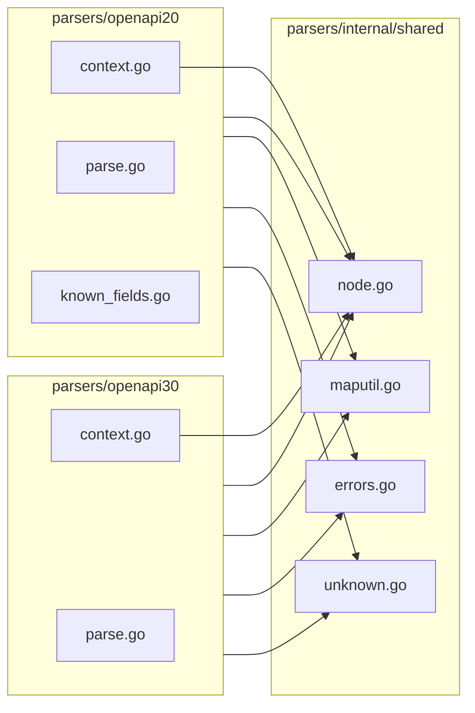

# Reuse duplicated utilities across OpenAPI 2.0 and 3.0 parsers

## Current duplication

| Area                  | openapi20  | openapi30  | Notes                                                                                                                                                                                                                                                          |
| --------------------- | ---------- | ---------- | -------------------------------------------------------------------------------------------------------------------------------------------------------------------------------------------------------------------------------------------------------------- |
| **node_helpers.go**   | ~305 lines | ~305 lines | Identical (only package name differs). YAML node access: nodeGetValue, nodeGetString, nodeToMap, nodeToInterface, parseNodeExtensions, nodeHasRef, etc.                                                                                                        |
| **helpers.go**        | ~232 lines | ~232 lines | Identical. Map helpers: getString, getBool, getInt, getMap, getSlice, parseExtensions, itoa, etc.                                                                                                                                                              |
| **errors.go**         | ~63 lines  | ~63 lines  | Identical. ParseError, newParseError, newParseErrorWithCause, Error(), Unwrap().                                                                                                                                                                               |
| **unknown_fields.go** | ~48 lines  | ~102 lines | Same idea; openapi20 uses UnknownField.Name and basePath; openapi30 uses Key, isExtension, formatPath, UnknownFieldError, itoa.                                                                                                                                |
| **context.go**        | ~136 lines | ~128 lines | Same structure (path stack, Push, Errorf, errorAt, detectUnknown, nodeSource, UnknownFieldsResult). Differences: openapi20 caches Definitions/Parameters/Responses and openapi20models.NodeSource; openapi30 caches Components and openapi30models.NodeSource. |

**Known_fields**: only openapi20 has [known_fields.go](parsers/openapi20/known_fields.go); it includes a small helper `toSet([]string) map[string]struct{}` that can move to shared code. The rest is spec-specific field lists and should stay in each parser.

**Ref parsers** (e.g. ref_schema, ref_parameter): same pattern but different model types and parse functions; no literal duplication to extract.

---

## Target layout

Introduce a shared package under `parsers` that both parsers import. Go’s `internal` rule allows `parsers/internal/...` to be imported only by the module (e.g. `openapi-parser/parsers/openapi20` and `.../openapi30`). Use a single internal package for all shared parser utilities to avoid many small packages.

- **New package**: `parsers/internal/shared` (or split into `parsers/internal/node`, `parsers/internal/maputil`, `parsers/internal/errors`, `parsers/internal/unknown` if you prefer finer-grained packages; the plan below assumes one `shared` package for simplicity).

---

## 1. Shared node helpers (yaml.Node)

- **Add** `parsers/internal/shared/node.go` (or `parsers/internal/node/node.go`).
- **Move** all logic from [parsers/openapi20/node_helpers.go](parsers/openapi20/node_helpers.go) into the shared package. Export functions with PascalCase: `NodeGetValue`, `NodeGetKeyNode`, `NodeToMap`, `NodeKeys`, `NodeMapPairs`, `NodeToSlice`, `NodeGetString`, `NodeGetBool`, `NodeGetBoolPtr`, `NodeGetInt`, `NodeGetFloat64`, `NodeGetFloat64Ptr`, `NodeGetIntPtr`, `NodeGetUint64Ptr`, `NodeGetStringSlice`, `NodeGetStringMap`, `NodeGetAny`, `NodeToInterface`, `NodeIsMapping`, `NodeIsSequence`, `NodeIsScalar`, `ParseNodeExtensions`, `NodeHasKey`, `NodeHasRef`, `NodeGetRef`.
- **Update** openapi20 and openapi30 to call `shared.NodeGetValue(...)` (or `node.NodeGetValue(...)`) everywhere they currently use `nodeGetValue`, etc. Remove [parsers/openapi20/node_helpers.go](parsers/openapi20/node_helpers.go) and [parsers/openapi30/node_helpers.go](parsers/openapi30/node_helpers.go).
- **Tests**: move or copy node helper tests into `parsers/internal/shared/node_test.go` (or the chosen package), and adjust tests to use the new package.

---

## 2. Shared map helpers (map[string]interface{})

- **Add** `parsers/internal/shared/maputil.go` (or `parsers/internal/maputil/maputil.go`).
- **Move** all logic from [parsers/openapi20/helpers.go](parsers/openapi20/helpers.go) (getString, getBool, getInt, getMap, getSlice, parseExtensions, itoa, etc.) into the shared package with exported names: `GetString`, `GetBool`, `Itoa`, etc.
- **Update** openapi20 and openapi30 to use the shared package (e.g. `shared.GetString`, `shared.Itoa`) and remove their local `helpers.go`.
- **Tests**: consolidate map helper tests in the shared package.

---

## 3. Shared parse errors

- **Add** `parsers/internal/shared/errors.go`.
- **Move** `ParseError` and constructors (`NewParseError`, `NewParseErrorWithCause`) from [parsers/openapi20/errors.go](parsers/openapi20/errors.go) / [parsers/openapi30/errors.go](parsers/openapi30/errors.go) into the shared package.
- **Update** both parsers to use the shared type (e.g. return `*shared.ParseError`). Context’s `Errorf` / `errorAt` should call shared constructors. Callers already use `error`; the concrete type can be `*shared.ParseError`. Remove duplicate `errors.go` in both parser packages.
- **Tests**: move error tests to shared package or keep minimal tests in each parser that assert on `errors.As` to `*shared.ParseError`.

---

## 4. Shared unknown-field detection

- **Add** `parsers/internal/shared/unknown.go`.
- **Define** a single `UnknownField` struct: `Path`, `Key`, `Line`, `Column`. For backward compatibility with openapi20’s public API (which uses `field.Name` in [doc.go](parsers/openapi20/doc.go) and tests), add a `Name` field that is always set to the same value as `Key` so existing code using `result.UnknownFields[i].Name` still works.
- **Move** `DetectUnknownNodeFields(node, knownFields, path)`, `IsExtension(key)`, and (if desired) `FormatPath(segments)`, `UnknownFieldError`, and `FormatUnknownFieldMessage` into the shared package. Use shared `Itoa` for message formatting.
- **Update** openapi20 and openapi30:
  - Use `shared.UnknownField` in `ParseResult` and context (e.g. `*[]shared.UnknownField`). Type-alias in each parser if you want `openapi20.UnknownField` to remain: `type UnknownField = shared.UnknownField`.
  - Replace local `detectUnknownNodeFields` with `shared.DetectUnknownNodeFields`; pass `ctx.CurrentPath()` (openapi30 already does; openapi20 currently builds path as basePath + "." + key — unify so both pass the current path string from context).
- **Remove** [parsers/openapi20/unknown_fields.go](parsers/openapi20/unknown_fields.go) and [parsers/openapi30/unknown_fields.go](parsers/openapi30/unknown_fields.go) after migration.
- **Tests**: move unknown-field detection tests to the shared package; keep integration tests in each parser that assert on `ParseWithUnknownFields` and `result.UnknownFields`.

---

## 5. Context and known-fields helper

- **Keep** [parsers/openapi20/context.go](parsers/openapi20/context.go) and [parsers/openapi30/context.go](parsers/openapi30/context.go) in each parser (different cached sections and different `NodeSource` types from models). Have them call shared code:
  - Use `shared.NodeGetValue(ctx.Root, "definitions")` etc. (openapi20) and `shared.NodeGetValue(ctx.Root, "components")` (openapi30).
  - Use `shared.DetectUnknownNodeFields` and append to `*[]shared.UnknownField`.
  - Use `shared.NewParseError` in `Errorf` / `errorAt`.
  - `nodeSource` stays in each package (returns `openapi20models.NodeSource` / `openapi30models.NodeSource`); it can call `shared.NodeToInterface(node)` for `Raw`.
- **Optional**: move `toSet(fields []string) map[string]struct{}` from [parsers/openapi20/known_fields.go](parsers/openapi20/known_fields.go) to `parsers/internal/shared/set.go` and use it from openapi20 (and openapi30 if it introduces known-field sets later). Keep all spec-specific field slices and sets in each parser.

---

## 6. Import and test strategy

- Both parsers will import `openapi-parser/parsers/internal/shared` (or the chosen subpackages).
- Run `go build ./...` and all tests (`go test ./...`) after each step to avoid regressions.
- Preserve backward compatibility: openapi20’s `result.UnknownFields[i].Name` and doc example should keep working (shared `UnknownField` with `Name == Key`).

---

## Order of work (suggested)

1. Create `parsers/internal/shared` and add **node** helpers + tests; switch both parsers to use them and delete duplicate node_helpers.
2. Add **map** helpers + **Itoa** to shared; switch both parsers; delete duplicate helpers.
3. Add **errors** to shared; switch both parsers; delete duplicate errors.
4. Add **unknown** (UnknownField, DetectUnknownNodeFields, etc.) to shared; switch both parsers and context; delete duplicate unknown_fields.
5. Optionally move **toSet** to shared and use from openapi20 (and openapi30 if applicable).

---

## Summary diagram

After refactor, openapi20 and openapi30 no longer contain duplicate implementations of node helpers, map helpers, parse errors, or unknown-field detection; they only retain parser-specific types (e.g. ParseContext, nodeSource, known field sets) and call into the shared package.